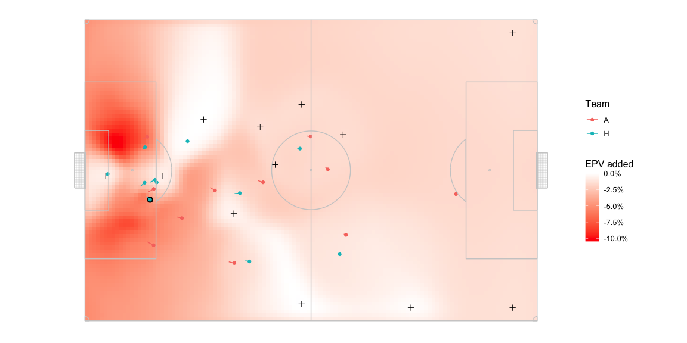
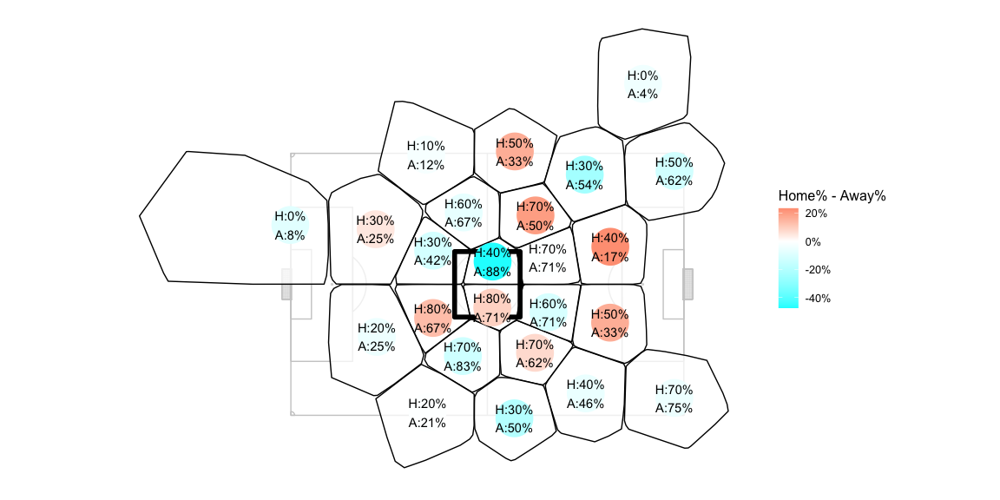

# Using EPV local optimas to find team structures

## Introduction

Quick glossary first:

-   Possession value: a measure of the potential for scoring a team has
    after they have a ball in a particular part of the pitch. Is a
    different value assigned to different parts of the pitch.

-   Pitch control: an estimate of the probability of a team controlling
    the ball in various parts of the pitch if it were passed there in
    the given situation.

-   Expected Possession Value: Multiply the pitch control probability
    values with the possession value of the respective part of the pitch
    to get a probabilistic possession value. Higher value parts of the
    pitch for the team likely have lower pitch control for them since
    the defending team is likely defending that territory more intensely
    than lesser value territory.

-   EPV added: EPV - the possession value from where the team currently
    has the ball

The part where the EPV is the highest at any instant is usually a proxy
for the best passing option available to the team at that instant, since
that pass is likely to maintain or increase the danger of scoring the
most even after accounting for the risk of losing the ball to the
opposition.

I think another set of interesting points we can extricate from the EPV
map over the pitch is the local maximas, i.e. the place where the EPV is
the highest compared to the EPV values in its immediate neighbourhood.
The global maxima can only be one but the rest of the players are also
trying to do things in the rest of the pitch and my hypothesis is that
the local optimas might be more reflective of what the entire team is
doing as a combined unit.

A plug for my own work - I use intent based EPV and not outcome based
EPV. You can read more about it here -
<https://thecomeonman.github.io/IntentVsOutcome/>. The glossary above is
still broad strokes okay though so you don’t really have to.

## Illustration

Here is what EPV added looks like for a random frame of tracking data -
The bluer the area, the higher the EPV for the home team on passing the
ball there. There is barely any blue though so what they should be
really going for are the white areas which offer veeeeeeeeery little EPV
added. The ball is with the home team in blue. The blue player with a
strong black outline near the edge of their defensive box has the ball.

The plus marks where the highest value of EPV is in this situation:

It’s mostly the two home team players near the halfway point towards the
right of the pitch probably contributing to this.

Adding other plus marks for the local optimas makes it look like this:

This gives an idea of where the rest of the team might be trying to
provide a passing option to the player with the ball. Except for the
global maxima we saw in the previous figure, there are options in the
centre of the pitch, a couple of options on the edge of the defensive
third, etc. being offered due to the pitch control being exerted by
players other than the two players on the left wing high up the pitch.

There are two more right towards the far corners of the pitch also.
These are unrealistic since nobody attempts passes that long. Durng the
rest of the analysis we will only look at passes that cover less than
2/3 the length of the pitch to limit it to realistic passes.

## An Example of Use

To demonstrate I’m going to look at Sample\_Game\_1 from Metrica Sports’
open tracking data and see how the home team compares to the away team.

I'll focus on when one of the midfielders from either team has the ball in the centre circle area and we'll see how often local maximas appear in various areas on the pitch. I do some clustering to break the area around the ball in smaller areas and then compare how often each of the teams has a local maxima falling in that area.

I do the clustering on the two dimensions of - LocalMaximaX - BallX and LocalMaximaY - BallY across the entire dataset and I'm also looking at a non-point area on the pitch so some of the clusters will stretch beyond the pitch. Don't fret too much about that, just use this viz as a rough reference to a particular area of the pitch having local maximas.

Both teams frame of reference is changed so that both teams are attacking left to right. The dark bordered square indicates the area in which the ball is for the subset of frames being analysed here. The percentages and the annotations indicate the percent of total frames in which the respective team had at least one local maxima in that area.

The home team’s midfiedlers tends to have far more local maximas being
made available to them: 
- towards the left in the immediate vicinity of
the ball 
- towards the right wing in the middle and final third 
- towards the left corner in the final and defensive third

The away team’s midfielders tends to have far more local maximas being
made available to them: 
- back towards the defensive third on the centre
and right ß
- near the edge of the box

## More Analysis Pending

Can’t conclude much yet. Going to keep working on this.
